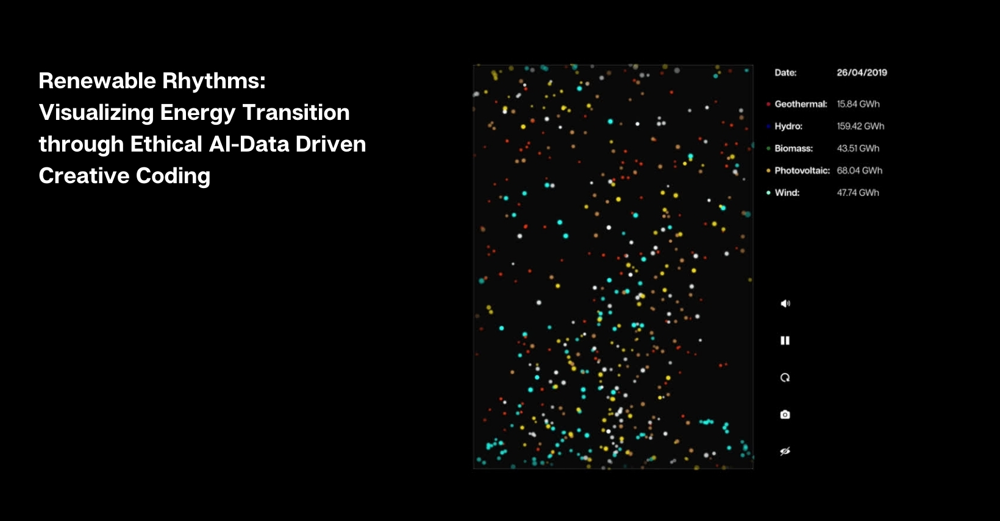

# Renewable Rhythms — Visualizing Energy Transition through Ethical AI-Data Driven Creative Coding

[Paper](https://www.researchgate.net/publication/380842244_Renewable_Rhythms_Visualizing_Energy_Transition_through_Ethical_AI-Data_Driven_Creative_Coding) · [Demo](https://thewhatifproject.com/renewable/index.html)



## Panoramica
Renewable Rhythms è una data painting interattiva che trasforma i dati pubblici sulla produzione giornaliera di energia rinnovabile in Italia in un racconto visivo e sonoro. Il progetto combina metodologie data‑driven, AI etica e creative coding (p5.js) per generare un paesaggio di particelle guidate da campi di flusso, dove ogni fonte (biomassa, fotovoltaico, idroelettrico, geotermico, eolico) si manifesta con movimento, colore e suono distintivi.

## Requisiti
- Browser moderno (Chrome, Edge, Firefox, Safari)
- Consigliato: server statico locale per evitare problemi di CORS nel caricamento del CSV e degli audio

## Installazione e Avvio
1. Clona il repository:
   ```sh
   git clone https://github.com/thewhatifproject/renewablerhythms.git
   cd renewablerhythms
   ```
2. Avvia un server statico locale (scegline uno):
   - Python 3: `python -m http.server 8000`
   - Node.js (http-server): `npx http-server -p 8000`
   - Node.js (serve): `npx serve -l 8000`
3. Apri il browser su `http://localhost:8000/` e carica `index.html`.

Nota: puoi anche aprire `index.html` direttamente, ma alcuni browser bloccano il caricamento di file locali (CSV/audio). In tal caso usa un server locale.

## Struttura del Progetto
```
.
├─ index.html
├─ sketch.js
├─ css/
│  └─ style.css
├─ lib/
│  ├─ p5.min.js
│  └─ howler.min.js
├─ data/
│  └─ dailyproduction.csv
├─ sounds/
│  ├─ Biomass.mp3
│  ├─ Geothermal.mp3
│  ├─ Hydro.mp3
│  ├─ Photovoltaic.mp3
│  └─ Wind.mp3
├─ icons/
│  ├─ camera.png
│  ├─ fullscreen.png
│  ├─ hide.png
│  ├─ loading.gif
│  ├─ mute.png
│  ├─ pause.png
│  ├─ play.png
│  ├─ refresh.png
│  ├─ screen.png
│  ├─ show.png
│  ├─ sound.png
│  └─ volume.png
└─ img/
   └─ metashare.jpg
```

## Dati
- Sorgente: Transparency Report [Terna](https://www.terna.it/)
- Formato atteso del CSV (`data/dailyproduction.csv`):
  - Colonne: `Date, Energy Source, Renewable Generation [GWh]`
  - Esempio:
    ```csv
    Date,Energy Source,Renewable Generation [GWh]
    2019-01-01,Biomass,32.31
    2019-01-01,Geothermal,16.08
    ```

## Interazione e Controlli
- Start Full Experience: avvio con audio (richiede interazione utente per policy dei browser)
- Continue without Audio: avvio silenzioso
- Volume: abilita/disabilita i suoni
- Play/Pause: avvia o mette in pausa animazione e suoni
- Refresh: ricomincia e ricalibra la visualizzazione
- Snapshot: salva un’immagine del canvas
- Hide/Show Labels: mostra/nasconde le etichette dei valori
- Fullscreen: alterna la modalità a schermo intero
- Click/Tap sul canvas: interazione diretta con il campo di flusso

## Tecnologie
- p5.js per grafica e interazione (`lib/p5.min.js`)
- Howler.js per l’audio (`lib/howler.min.js`)
- Progetto statico, nessuna build richiesta

## Metodologia (sintesi)
Particelle guidate da un flow field generato con Perlin noise rappresentano i valori giornalieri per fonte. Grandezza, velocità, sfocatura e colore variano in funzione dell’energia prodotta; i suoni si modulano in ampiezza sulla stessa dinamica.

## Ricerca e Riferimenti
- Paper: Renewable Rhythms — Visualizing Energy Transition through Ethical AI-Data Driven Creative Coding
- Demo: https://thewhatifproject.com/renewable/index.html
- p5.js: https://p5js.org/
- Howler.js: https://howlerjs.com/
- Dati Terna: https://www.terna.it/

## Troubleshooting
- Pulsanti disabilitati su “Loading Data…”: avvia da un server locale e verifica che `data/dailyproduction.csv` e i file audio in `sounds/` siano presenti. Controlla la console del browser per eventuali errori di rete.
- Audio non parte automaticamente: i browser richiedono un click esplicito (usa “Start Full Experience”).

## Crediti
- Autore: Daniele Giannini (The “What If” Project)
- Icone: heisenberg_jr (Flaticon)
- Supporto creativo/coding: LLM Codex GPT‑4o

## Contributi
Contributi benvenuti! Fai una fork e apri una pull request con modifiche mirate e descritte chiaramente.

## Citazione
Se utilizzi questo progetto in una pubblicazione, cita il [paper](https://www.researchgate.net/publication/380842244_Renewable_Rhythms_Visualizing_Energy_Transition_through_Ethical_AI-Data_Driven_Creative_Coding):
```bibtex
@article{renewablerhythms,
  title={Renewable Rhythms: Visualizing Energy Transition through Ethical AI-Data Driven Creative Coding},
  author={Daniele Giannini as The 'What If' Project},
  journal={Research Gate},
  year={2024},
  doi={http://dx.doi.org/10.13140/RG.2.2.14286.47680}
}
```

## Licenza
MIT — vedi `LICENSE`.

